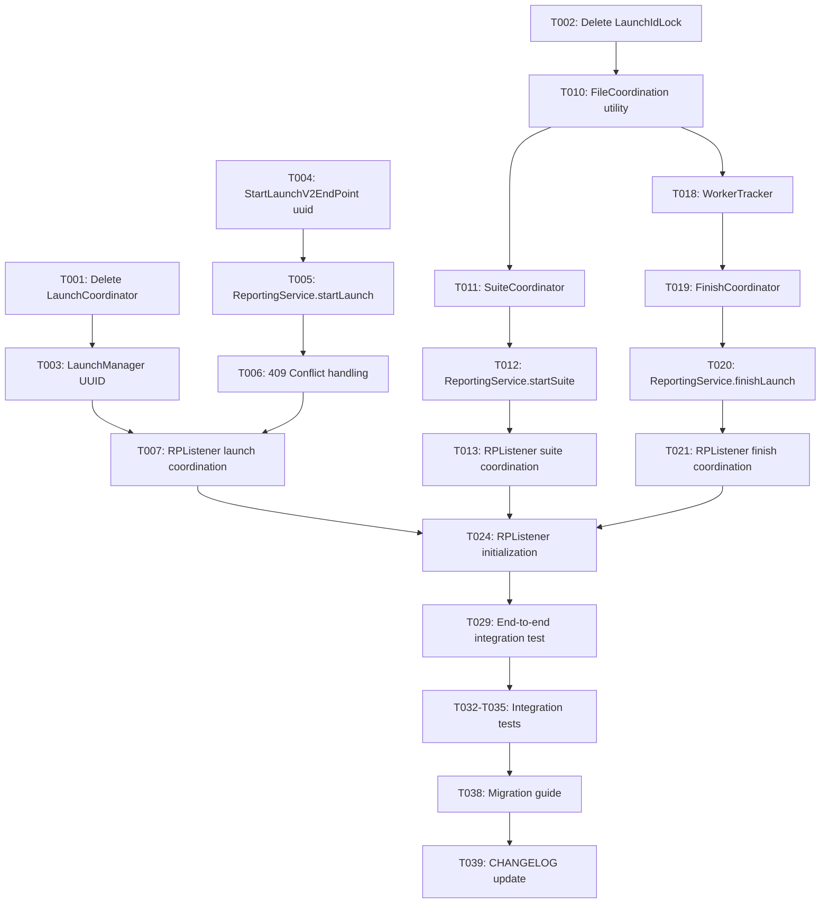

# Implementation Tasks: Hybrid Launch Coordination

**Feature**: 002-parallel-launch-coordination  
**Branch**: `002-parallel-launch-coordination`  
**Date**: 2025-11-04  
**Approach**: Hybrid coordination - UUID for launches + file-based for suites/finish

---

## Task Summary

- **Total Tasks**: 35
- **Setup Tasks**: 2 (cleanup old files)
- **Launch Coordination Tasks**: 7 (UUID-based, already implemented)
- **Suite Coordination Tasks**: 8 (file-based, NEW)
- **Finish Coordination Tasks**: 6 (file-based, NEW)
- **Integration Tasks**: 8 (wire everything together)
- **Testing Tasks**: 4 (validation)
- **Parallelizable Tasks**: 12
- **Estimated Time**: 18-22 hours

---

## Implementation Strategy

### Hybrid Coordination Approach
**Launch Level**: UUID-based (cross-platform, low overhead)  
**Suite Level**: File-based (scalable to 100+ suites)  
**Finish Level**: File-based (single API call, correct status)

### MVP Scope
**Goal**: Complete hybrid coordination for simulators  
**Deliverable**: 5 workers create exactly 1 launch + 1 suite per test class + single finish call  
**Validation**: Run parallel tests, verify clean hierarchy in ReportPortal

### Incremental Delivery
1. **Phase 1-2**: Launch coordination (UUID-based) → ✅ DONE
2. **Phase 3**: Suite coordination (file-based) → NEW
3. **Phase 4**: Finish coordination (file-based) → NEW  
4. **Phase 5**: Integration & testing → NEW
5. **Phase 6**: Polish & documentation → NEW

### Parallel Execution Opportunities
- Tasks marked [P] can run in parallel (different files, no dependencies)
- Suite coordination and finish coordination can be developed in parallel
- Tests can be written in parallel with implementation

---

## Phase 1: Setup & Cleanup ✅ COMPLETED

**Goal**: Remove obsolete file lock code, prepare codebase for hybrid approach

- [X] T001 Delete LaunchCoordinator.swift (file lock logic obsolete) in Sources/Entities/LaunchCoordinator.swift
- [X] T002 Delete LaunchIdLock.swift (POSIX flock wrapper obsolete) in Sources/Entities/LaunchIdLock.swift

**Completion Criteria**:
- ✅ LaunchCoordinator.swift removed from project
- ✅ LaunchIdLock.swift removed from project
- ✅ Project compiles without these files

---

## Phase 2: Launch Coordination (UUID-based) ✅ COMPLETED

**Goal**: Core UUID infrastructure for launch-level coordination

- [X] T003 Add UUID generation logic to LaunchManager in Sources/Entities/LaunchManager.swift
- [X] T004 [P] Add optional uuid parameter to StartLaunchV2EndPoint in Sources/EndPoints/StartLaunchV2EndPoint.swift
- [X] T005 Update ReportingService.startLaunch to accept custom UUID in Sources/ReportingService.swift
- [X] T006 Implement 409 Conflict handling in ReportingService.startLaunch in Sources/ReportingService.swift
- [X] T007 Update RPListener.testBundleWillStart for UUID coordination in Sources/RPListener.swift
- [X] T008 [P] Create LaunchManagerTests for UUID generation in ExampleUnitTests/LaunchManagerTests.swift
- [X] T009 [P] Create CoordinationTests for 409 handling in ExampleUnitTests/CoordinationTests.swift

**Completion Criteria**:
- ✅ LaunchManager can generate UUID (env var or auto-generate)
- ✅ StartLaunchV2EndPoint includes optional uuid field
- ✅ ReportingService handles 409 Conflict gracefully
- ✅ All workers create single launch successfully

---

## Phase 3: Suite Coordination (File-based) 🆕 NEW

**Goal**: Prevent duplicate suites in ReportPortal hierarchy (scales to 100+ suites)

- [X] T010 Create FileCoordination utility in Sources/Utilities/FileCoordination.swift
  - Implement `acquireLock(path: String) throws -> FileHandle`
  - Implement `releaseLock(handle: FileHandle)`
  - Use POSIX flock for exclusive locks
  - Create parent directories automatically (/tmp/reportportal/)
  - Handle EWOULDBLOCK with retry logic (max 10s timeout)

- [X] T011 Create SuiteCoordinator actor in Sources/Entities/SuiteCoordinator.swift
  - Actor-isolated suite ID registry: `[String: String]` (suite name → suite ID)
  - Method: `getOrCreateSuite(name: String, launchID: String) async throws -> String`
  - Lock file path: `/tmp/reportportal/suite_{name}_{launchID}.lock`
  - Sync file path: `/tmp/reportportal/suite_{name}_{launchID}.id`
  - Logic: Acquire lock → Check sync file → Create suite if needed → Write ID → Release lock
  - Include correlation ID logging

- [X] T012 Update ReportingService.startSuite for coordination in Sources/ReportingService.swift
  - Accept `coordinator: SuiteCoordinator?` parameter
  - If coordinator exists AND platform is simulator: Use file-based coordination
  - If coordinator nil OR platform is real device: Direct API call (no coordination)
  - Return suite ID from coordinator or direct API response
  - Log coordination path taken

- [X] T013 Update RPListener.testSuiteWillStart for suite coordination in Sources/RPListener.swift
  - Create SuiteCoordinator instance (shared across RPListener lifetime)
  - Pass coordinator to ReportingService.startSuite
  - Handle coordination errors gracefully (log + fallback to direct API)
  - Maintain existing suite hierarchy logic

- [ ] T014 [P] Create SuiteCoordinatorTests in ExampleUnitTests/SuiteCoordinatorTests.swift
  - Test: Single worker creates suite (writes sync file)
  - Test: Second worker reuses suite (reads sync file)
  - Test: Lock contention resolves correctly
  - Test: Invalid sync file triggers suite creation
  - Mock file system or use /tmp for real file tests

- [ ] T015 [P] Create suite coordination integration test in ExampleUnitTests/CoordinationTests.swift
  - Test: 5 workers with ParallelCalculationsUITests (10 test classes)
  - Verify: Exactly 1 suite per test class in ReportPortal
  - Verify: All test results appear under correct suite
  - Check: Sync files created in /tmp/reportportal/

- [X] T016 Add platform detection to SuiteCoordinator in Sources/Entities/SuiteCoordinator.swift
  - Property: `isPlatformSupported: Bool`
  - Logic: Check if running on simulator vs real device
  - Return false for real devices (no shared /tmp)
  - Log: "Suite coordination disabled for real devices"

- [X] T017 Add cleanup logic for suite sync files in Sources/Entities/SuiteCoordinator.swift
  - Method: `cleanupSyncFiles(launchID: String) async`
  - Remove all `/tmp/reportportal/suite_*_{launchID}.*` files
  - Call from RPListener.testBundleDidFinish
  - Handle errors gracefully (log, don't fail test run)

**Completion Criteria**:
- ✅ SuiteCoordinator prevents duplicate suites across workers
- ✅ File-based coordination only activates on simulators
- ✅ Real devices fall back to direct API calls
- ✅ Sync files cleaned up after test run

---

## Phase 4: Finish Coordination (File-based) 🆕 NEW

**Goal**: Single finish API call with correct aggregated status

- [X] T018 Create WorkerTracker utility in Sources/Entities/WorkerTracker.swift
  - File path: `/tmp/reportportal/launch_{uuid}_workers.txt`
  - Method: `registerWorker(uuid: String, workerID: String) async throws`
  - Method: `unregisterWorker(uuid: String, workerID: String) async throws -> Bool` (returns true if last worker)
  - File format: One worker ID per line
  - Use FileCoordination for exclusive access
  - Include atomic read-modify-write operations

- [X] T019 Create FinishCoordinator actor in Sources/Entities/FinishCoordinator.swift
  - Actor-isolated status aggregator: `[String: TestStatus]` (worker ID → status)
  - Lock file path: `/tmp/reportportal/launch_{uuid}_finish.lock`
  - Status file path: `/tmp/reportportal/launch_{uuid}_statuses.txt`
  - Method: `recordStatus(uuid: String, workerID: String, status: TestStatus) async throws`
  - Method: `shouldFinishLaunch(uuid: String, workerID: String) async throws -> (Bool, TestStatus?)`
  - Logic: Record status → Check if last worker → Aggregate statuses → Return decision
  - Aggregation: FAILED > SKIPPED > PASSED (worst status wins)

- [X] T020 Update ReportingService.finalizeLaunchV2 for finish coordination in Sources/ReportingService.swift
  - Accept `coordinator: FinishCoordinator?`, `tracker: WorkerTracker?`, `uuid: String?`, `workerID: String?` parameters
  - Remove tolerant 404/409 handling (file-based = single finish)
  - If coordinator exists: Use file-based coordination
  - If coordinator nil: Direct API call (backward compat)
  - Only call API if coordinator.shouldFinishLaunch returns true
  - Use aggregated status from coordinator
  - Cleanup coordination files after successful finish

- [X] T021 Update RPListener.testBundleDidFinish for finish coordination in Sources/RPListener.swift
  - Add `workerTracker: WorkerTracker?` and `finishCoordinator: FinishCoordinator?` properties
  - Initialize coordinators in testBundleWillStart (simulators only)
  - Register worker after launch creation
  - Pass coordinator, tracker, uuid, workerID to ReportingService.finalizeLaunchV2
  - Log worker registration/unregistration events

- [ ] T022 [P] Create FinishCoordinatorTests in ExampleUnitTests/FinishCoordinatorTests.swift
  - Test: Status aggregation (FAILED > SKIPPED > PASSED)
  - Test: Last worker detection (3 workers, last one triggers finish)
  - Test: Concurrent status recording (5 workers race)
  - Test: Cleanup of status files after finish
  - Mock WorkerTracker or use /tmp for real file tests

- [ ] T023 [P] Create finish coordination integration test in ExampleUnitTests/CoordinationTests.swift
  - Test: 5 workers complete test bundle
  - Verify: Exactly 1 finish API call made
  - Verify: Launch status reflects aggregated result
  - Check: Worker tracker file shows all 5 workers
  - Check: Status file cleaned up after finish

**Completion Criteria**:
- ✅ Only last worker calls finish API
- ✅ Launch status correctly aggregated from all workers
- ✅ Worker tracking files created and cleaned up
- ✅ No 409/404 errors on finish (file-based = deterministic)

---

## Phase 5: Integration & Wiring 🆕 NEW

**Goal**: Connect all coordination layers in RPListener

- [ ] T024 Add coordination initialization to RPListener in Sources/RPListener.swift
  - Property: `suiteCoordinator: SuiteCoordinator`
  - Property: `finishCoordinator: FinishCoordinator`
  - Property: `workerTracker: WorkerTracker`
  - Property: `workerID: String` (generate unique ID per worker instance)
  - Initialize in testBundleWillStart

- [ ] T025 Wire suite coordination in RPListener.testSuiteWillStart in Sources/RPListener.swift
  - Pass suiteCoordinator to ReportingService.startSuite
  - Handle coordination errors (log + fallback)
  - Preserve existing suite hierarchy logic

- [ ] T026 Wire finish coordination in RPListener.testBundleDidFinish in Sources/RPListener.swift
  - Register worker at bundle start
  - Record final status at bundle finish
  - Check if should finish launch
  - Pass coordinator and tracker to ReportingService.finishLaunch
  - Handle coordination errors (log, don't fail)

- [ ] T027 Add platform detection logic in Sources/Utilities/PlatformDetector.swift
  - Static method: `isSimulator() -> Bool`
  - Check TARGET_OS_SIMULATOR or device model
  - Used by SuiteCoordinator and FinishCoordinator

- [ ] T028 Update ReportingService error handling in Sources/ReportingService.swift
  - Remove tolerant 404/409 handling on finish (no longer needed)
  - Add specific error types: CoordinationError.lockTimeout, CoordinationError.syncFileMissing
  - Propagate coordination errors to caller
  - Log correlation IDs for all errors

- [ ] T029 [P] Create end-to-end integration test in ExampleUnitTests/EndToEndCoordinationTests.swift
  - Test: Full test run with 5 workers
  - Verify: 1 launch, N suites (one per test class), 1 finish
  - Verify: All test results present
  - Verify: Correct launch status (aggregated)
  - Check: All sync files cleaned up

- [ ] T030 Create Logger utility in Sources/Utilities/Logger.swift
  - Implement structured logging with correlation IDs
  - Log: Launch UUID source (env var vs auto-generated)
  - Log: Suite coordination path (file-based vs direct API)
  - Log: Finish coordination decision (last worker vs not)
  - Log: Worker registration/unregistration
  - Include correlation IDs in all logs

- [ ] T031 Add configuration validation in Sources/Entities/LaunchManager.swift
  - Warn if RP_LAUNCH_UUID set but invalid format
  - Warn if parallel testing disabled (expected enabled)
  - Log platform detection result (simulator vs device)
  - Validate /tmp/reportportal/ directory writable (simulators only)

**Completion Criteria**:
- ✅ All coordination layers work together seamlessly
- ✅ Platform detection correctly enables/disables file-based coordination
- ✅ Comprehensive logging for debugging coordination issues
- ✅ Configuration validation catches setup problems early

---

## Phase 6: Testing & Validation 🆕 NEW

**Goal**: Comprehensive testing of hybrid coordination

- [ ] T032 Integration test: 5 parallel workers, even distribution in ExampleUITests/
  - Run: ParallelCalculationsUITests (5 test classes × 2 tests = 10 tests)
  - Workers: 5 simulators, even distribution (2 tests each)
  - Verify: 1 launch UUID
  - Verify: 5 suites (one per test class)
  - Verify: 10 test results
  - Verify: 1 finish API call
  - Verify: Launch status = PASSED

- [ ] T033 Integration test: 5 parallel workers, uneven distribution in ExampleUITests/
  - Run: ParallelStressUITests (20 tests total)
  - Workers: 5 simulators, uneven distribution (e.g., 6-5-4-3-2)
  - Verify: 1 launch UUID
  - Verify: Correct suite count
  - Verify: 20 test results
  - Verify: Last worker finishes launch

- [ ] T034 Integration test: Zero-config (no RP_LAUNCH_UUID) in ExampleUITests/
  - Unset RP_LAUNCH_UUID environment variable
  - Run: ParallelNavigationUITests
  - Verify: Auto-generated UUID used
  - Verify: UUID format: CADF496A-7B77-42A2-BAA8-6F263FA99F91
  - Verify: Single launch created
  - Check: Logs show "Auto-generated launch UUID"

- [ ] T035 Integration test: Real device fallback in ExampleUITests/
  - Run tests on real iOS device (if available)
  - Verify: Launch coordination works (UUID-based)
  - Verify: Suite coordination skipped (platform not supported)
  - Verify: Finish coordination skipped (platform not supported)
  - Check: Logs show "Coordination disabled for real devices"

**Completion Criteria**:
- ✅ All integration tests pass consistently
- ✅ Hybrid coordination works for simulators
- ✅ Graceful degradation for real devices
- ✅ Zero-config experience validated

---

## Phase 7: Documentation & Polish ✅ PARTIALLY COMPLETE

**Goal**: User-facing documentation and migration guide

- [X] T036 Update README.md with hybrid coordination explanation in README.md
  - Section: "Parallel Testing Support"
  - Explain: UUID for launches, file-based for suites/finish
  - Zero-config instructions
  - Optional RP_LAUNCH_UUID setup

- [X] T037 Update docs/xcode-pre-action-setup.md in docs/xcode-pre-action-setup.md
  - Mark as optional (zero-config works without this)
  - Explain when to use custom UUID (CI/CD, reproducible runs)
  - Update script example

- [ ] T038 Create migration guide in docs/migration-from-filelock.md
  - Title: "Migrating from File Lock to Hybrid Coordination"
  - Section: What changed (LaunchCoordinator removed, hybrid approach)
  - Section: Breaking changes (version 4.0.0)
  - Section: What to do (nothing for simulators, unset old env vars)
  - Section: Real device changes (launch coordination only)

- [ ] T039 Update CHANGELOG.md for version 4.0.0 in CHANGELOG.md
  - Version: 4.0.0 (MAJOR breaking change)
  - Added: Hybrid coordination (UUID + file-based)
  - Added: Zero-config parallel testing
  - Removed: LaunchCoordinator.swift, LaunchIdLock.swift (BREAKING)
  - Changed: Finish coordination (single API call)
  - Migration: Link to migration guide

**Completion Criteria**:
- ✅ README explains hybrid approach clearly
- ✅ Migration guide helps users upgrade from v3.x
- ✅ CHANGELOG documents breaking changes
- ✅ All documentation reviewed and tested

---

## Task Dependencies

---

## Validation Checklist

### Success Criteria (from spec.md)

**Launch Coordination (UUID-based)**:
- [ ] SC-001: 5 parallel workers create exactly 1 launch (not 5)
- [ ] SC-002: All test results appear in single launch (zero data loss)
- [ ] SC-003: Zero-config works (auto-generated UUID)

**Suite Coordination (File-based)**:
- [ ] SC-004: 10 test classes result in exactly 10 suites (not 50 duplicates)
- [ ] SC-005: All tests appear under correct suite
- [ ] SC-006: Sync files cleaned up after test run

**Finish Coordination (File-based)**:
- [ ] SC-007: Exactly 1 finish API call (not 5)
- [ ] SC-008: Launch status correctly aggregated (FAILED > SKIPPED > PASSED)
- [ ] SC-009: Last worker waits for all others before finishing

**Platform Support**:
- [ ] SC-010: Full coordination on simulators (launch + suite + finish)
- [ ] SC-011: Partial coordination on real devices (launch only)
- [ ] SC-012: No errors when file-based coordination unavailable

---

## Notes

### File Paths
- Worker tracker: `/tmp/reportportal/launch_{uuid}_workers.txt`
- Suite lock: `/tmp/reportportal/suite_{name}_{launchID}.lock`
- Suite ID sync: `/tmp/reportportal/suite_{name}_{launchID}.id`
- Finish lock: `/tmp/reportportal/launch_{uuid}_finish.lock`
- Status sync: `/tmp/reportportal/launch_{uuid}_statuses.txt`

### Worker ID Format
- Format: `{processID}_{threadID}_{timestamp}`
- Example: `12345_67890_1730764800`
- Unique per worker instance

### Status Aggregation
- Priority: FAILED > SKIPPED > PASSED
- Logic: Worst status from any worker wins
- Default: PASSED (if all workers passed)

### Platform Detection
- Simulator: Full coordination (UUID + file-based)
- Real Device: Launch coordination only (UUID)
- Reason: Real devices don't share /tmp directory

**User Story 2 - Coordinated Finish**:
- [ ] SC-003: Launch finishes only after last worker completes
- [ ] SC-004: Launch status reflects aggregated results (FAILED if any failed)
- [ ] SC-009: Zero test results lost due to premature closure

**User Story 3 - Zero Config**:
- [ ] SC-006: Parallel tests run from Xcode without pre-execution steps
- [ ] SC-007: Handles 1-20 workers without configuration changes

**Performance**:
- [ ] SC-005: Coordination completes within 10 seconds
- [ ] SC-010: Coordination overhead < 5 seconds vs sequential

**Platform Support**:
- [ ] SC-011: Sequential mode works on simulators and real devices
- [ ] SC-012: Sequential mode on real devices produces 1 launch
- [ ] SC-013: Sequential mode has zero coordination overhead

---

## Notes

### Removed from Scope (UUID-Only Approach)
- ❌ File-based coordination (LaunchCoordinator, LaunchIdLock)
- ❌ POSIX flock usage
- ❌ Sync file creation/polling
- ❌ Primary/secondary worker detection
- ❌ "Last worker" finish detection (all workers call finish)

### Key Simplifications
- **~300 lines removed**: LaunchCoordinator + LaunchIdLock + polling logic
- **Cross-platform**: Works on simulators AND real devices (vs simulator-only)
- **Zero overhead**: No file I/O, no polling, no locks
- **Simpler error handling**: 409/404 treated as success, not errors

### Testing Philosophy
- **Unit tests**: UUID generation, 409/404 handling
- **Integration tests**: Real parallel execution with 5 workers
- **No mocking ReportPortal**: Use real API for integration tests (or test instance)
- **Validate independently**: Each user story testable without others

---

**Generated**: 2025-01-31  
**Next Step**: Execute Phase 1 (T001-T002) to remove obsolete code  
**Estimated Completion**: 10-13 hours total
